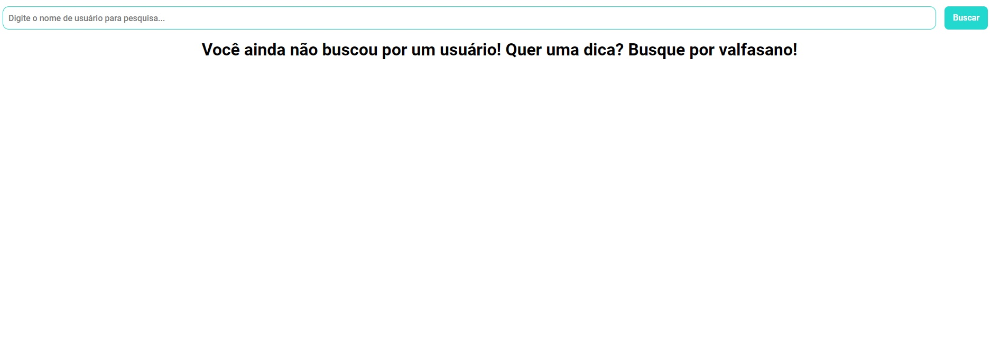
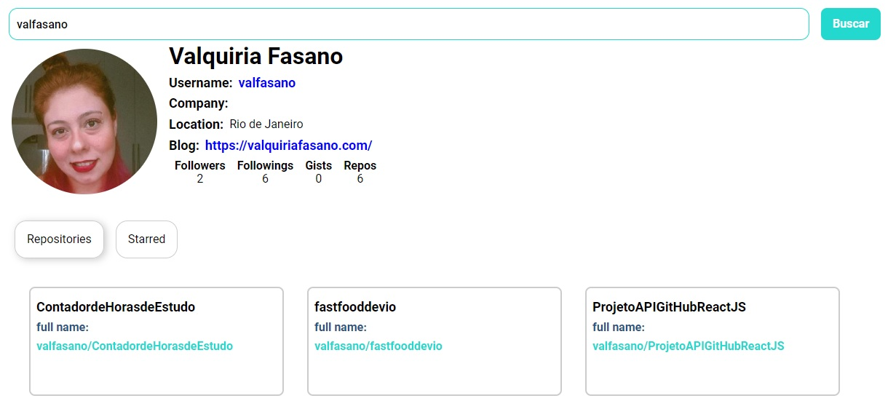

# Integração de API do Github

O projeto tem o objetivo de criar um aplicativo que busca perfis no Github.
Eu recriei para a conclusão do módulo "Desenvolvimento Web com React" para o Bootcamp da Digital Innovation One.

# Imagens

### Tela inicial

### Tela após pesquisa

## Create React App

Este projeto foi criado com [Create React App](https://github.com/facebook/create-react-app).

### Imagens do Projeto Personalizado:

https://www.imagemhost.com.br/image/rtbF5r

https://www.imagemhost.com.br/image/rtbEKi

### Bibliotecas usadas

- [axios](https://www.npmjs.com/package/axios)
- [react-tabs](https://www.npmjs.com/package/react-tabs)
- [styled-components](https://styled-components.com/)

